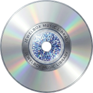

<div align="center">
  

  # JewelBox Music Library

  *Parce que vos albums méritent mieux qu'une simple étagère.*
</div>

## 🚀 Démarrage rapide (développement)

### Prérequis

- Node.js 20+
- npm 9+

### Installation

```bash
git clone https://github.com/ton-user/jewelbox-music-library.git
cd JewelBox-Music-Library
npm install
```

### Lancement

```bash
# Démarre le backend (port 3001) et le frontend (port 5173) simultanément
npm run dev
```

Ouvrir [http://localhost:5173](http://localhost:5173)

---

## 🐳 Docker

### Lancement avec Docker Compose (recommandé)

```bash
cd docker
docker compose up -d
```

L'application est accessible sur [http://localhost:3001](http://localhost:3001).  
Les bases de données et les pochettes sont persistées dans le volume `jewelbox_data`.

### Sans Docker Compose (Docker seul)

```bash
# 1. Build de l'image depuis la racine du projet
docker build -f docker/Dockerfile -t jewelbox .

# 2. Créer le volume pour persister les données
docker volume create jewelbox_data

# 3. Lancer le conteneur
docker run -d \
  -p 3001:3001 \
  -v jewelbox_data:/app/server/data \
  -e NODE_ENV=production \
  --name jewelbox-app \
  --restart unless-stopped \
  jewelbox
```

L'application est accessible sur [http://localhost:3001](http://localhost:3001).

```bash
# Arrêter / relancer
docker stop jewelbox-app
docker start jewelbox-app

# Voir les logs
docker logs -f jewelbox-app

# Mettre à jour (rebuild)
docker stop jewelbox-app && docker rm jewelbox-app
docker build -f docker/Dockerfile -t jewelbox .
docker run -d -p 3001:3001 -v jewelbox_data:/app/server/data \
  -e NODE_ENV=production --name jewelbox-app --restart unless-stopped jewelbox
```

### Données persistantes

Le volume Docker monte `/app/server/data` qui contient :

- les bases SQLite (`.db`)
- les pochettes téléchargées (`covers/`)

```bash
# Voir les données persistées
docker volume inspect jewelbox_data

# Sauvegarder les données
docker run --rm -v jewelbox_data:/data -v $(pwd):/backup \
  alpine tar czf /backup/jewelbox-backup.tar.gz /data
```

---

## 🧪 Tests

```bash
cd server && node ../node_modules/vitest/vitest.mjs run
```

---

## 🌐 API REST

| Méthode  | Endpoint                     | Description                              |
|----------|------------------------------|------------------------------------------|
| `GET`    | `/api/albums`                | Liste paginée (filtres, tri, recherche)  |
| `GET`    | `/api/albums/:id`            | Détail + pistes                          |
| `POST`   | `/api/albums`                | Créer un album                           |
| `PATCH`  | `/api/albums/:id`            | Modifier un album                        |
| `DELETE` | `/api/albums/:id`            | Supprimer un album                       |
| `PATCH`  | `/api/albums/:id/lend`       | Prêter / récupérer                       |
| `GET`    | `/api/albums/:id/loans`      | Historique des prêts                     |
| `GET`    | `/api/albums/export`         | Exporter la collection (CSV ou JSON)     |
| `POST`   | `/api/albums/import`         | Importer depuis un CSV                   |
| `GET`    | `/api/albums/duplicate`      | Vérifier si un doublon existe            |
| `GET`    | `/api/albums/genres`         | Liste des genres                         |
| `GET`    | `/api/search?q=`             | Recherche MusicBrainz par titre/artiste  |
| `GET`    | `/api/search?ean=`           | Recherche par EAN/code-barres            |
| `GET`    | `/api/search/:mbid`          | Détail complet d'une release             |
| `POST`   | `/api/upload/cover`          | Upload d'une pochette                    |
| `GET`    | `/api/database`              | Liste des bases de données               |
| `POST`   | `/api/database`              | Créer une nouvelle base                  |
| `POST`   | `/api/database/:id/activate` | Activer une base                         |
| `GET`    | `/api/database/active`       | Base de données active                   |

### Paramètres de `GET /api/albums`

| Paramètre | Type    | Description                             |
|-----------|---------|-----------------------------------------|
| `page`    | entier  | Numéro de page (défaut : 1)             |
| `limit`   | entier  | Albums par page (défaut : 24, max : 100)|
| `genre`   | texte   | Filtrer par genre                       |
| `rating`  | entier  | Filtrer par note (1-5)                  |
| `sort`    | texte   | `title`, `artist`, `year`, `rating`     |
| `order`   | texte   | `asc` ou `desc`                         |
| `search`  | texte   | Recherche sur titre et artiste          |
| `wanted`  | booléen | `true` = liste de souhaits uniquement   |
| `lent`    | booléen | `true` = albums prêtés uniquement       |

---

## 📄 Licence

Ce projet est distribué sous licence **MIT**.  
Voir le fichier [LICENSE](LICENSE) pour le texte complet.

---
